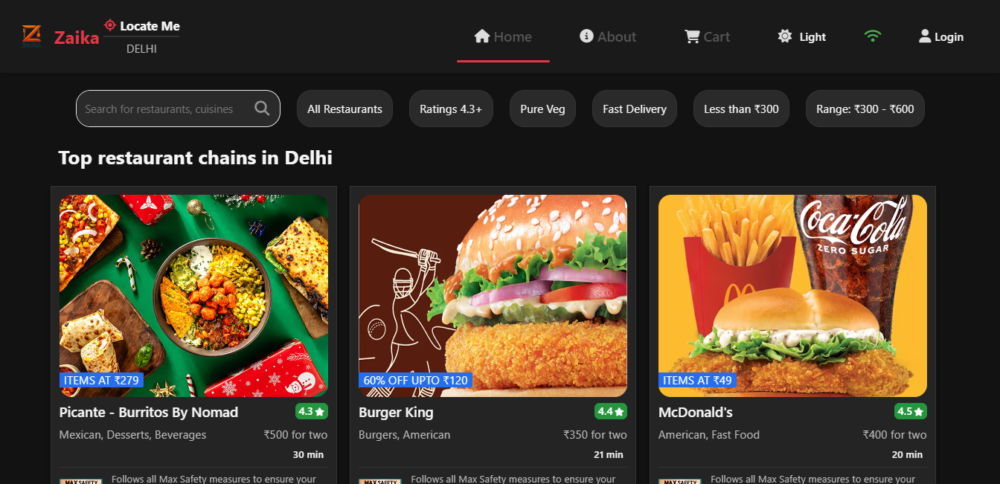
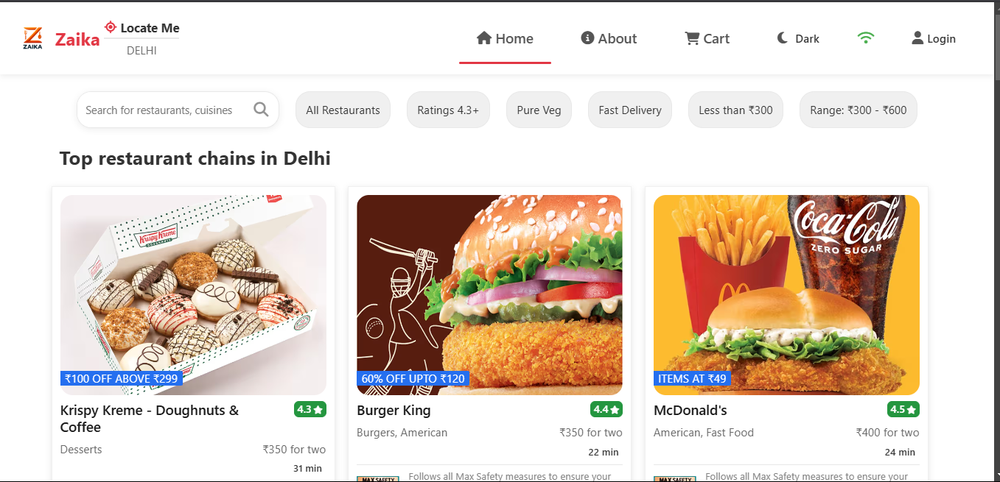

# Zaika - Food Delivery Platform 🍕🍔

<div align="center">
  
</div>

## 📸 Screenshots

### Light Mode - Home Page


### Dark Mode - Restaurant Listing


## 📌 Live Demo & Links

- **Live Website:** [Zaika Food Delivery](https://zaikaafood.netlify.app/)
- **GitHub Repository:** [food-website-main](https://github.com/ankit6686510/food-website-main/tree/main)
- **Developer Portfolio:** [Ankit's Portfolio](https://ankit6686510.github.io/NewPortfolio/)

## 📋 Overview

Zaika is a dynamic food delivery web application built with React and Redux Toolkit, offering users a seamless experience to browse restaurants, explore menus, and order food online. The application uses Swiggy's API to fetch real restaurant data and features a modern, responsive UI with both light and dark theme support.

## ✨ Key Features

- **Location-based Restaurant Display:** Discover restaurants near you with Zaika's location-aware features.
- **Advanced Filtering Options:**
  - Rating filter (4.3+)
  - Pure Veg options
  - Fast Delivery filter
  - Price range filters (Less than ₹300, ₹300-₹600)
- **Real-time Search:** Instantly find restaurants by name or cuisine.
- **Responsive Design:** Seamless experience across all devices.
- **Cart System:** Add items to cart, adjust quantities, and proceed to checkout.
- **Dark/Light Theme Toggle:** User preference-based theme switching with localStorage persistence.
- **Online/Offline Status Indicator:** Visual indicator of internet connectivity.
- **Shimmer UI:** Enhanced user experience with placeholder animations during data loading.

## 🛠️ Technical Stack

- **Frontend:** 
  - React.js (UI Library)
  - Redux Toolkit (State Management)
  - React Router (Navigation)
  - Custom React Hooks
  - React Suspense & Lazy Loading
  - CSS3 (Styling)

- **API Integration:**
  - Custom Proxy Server using Express.js
  - Axios for API calls
  - Error Boundary Implementation

- **Build Tools:**
  - Parcel (Bundler)
  - Babel (JavaScript Compiler)

- **Testing:**
  - Jest (Testing Framework)

- **Deployment:**
  - Netlify (Frontend)
  - Render (Proxy Server)

## 🚀 Setup & Installation

1. **Clone the repository:**
   ```bash
   git clone https://github.com/ankit6686510/food-website-main.git
   cd food-website-main
   ```

2. **Install dependencies:**
   ```bash
   npm install
   ```

3. **Start the development server:**
   ```bash
   npm start
   ```

4. **For proxy server setup:**
   ```bash
   cd swiggy-proxy-server
   npm install
   npm start
   ```

## 🎨 Implementation Details

### State Management with Redux Toolkit

Zaika implements Redux Toolkit for efficient state management, separating concerns into dedicated slices:

```javascript
// Store configuration
const store = configureStore({
  reducer: {
    cart: cartReducer,
    user: userReducer,
    theme: themeReducer,
  },
});
```

### Custom Hooks

The application uses several custom hooks to enhance reusability:

- **useTheme:** Manages light/dark theme preferences with localStorage persistence
- **useOnlineStatus:** Detects and manages network connectivity status
- **useRestaurantData:** Handles restaurant data fetching and error handling

### Optimizations

- **Code Splitting:** Using React.lazy() and Suspense for component-level code splitting
- **Memoization:** Using React.memo() and useMemo() for performance optimization
- **Debouncing:** Implemented in search functionality to reduce API calls

## 💻 Code Examples

### 1. Theme Context and Hook Implementation:

```jsx
// ThemeContext.js
import { createContext } from 'react';

const ThemeContext = createContext({
  theme: 'light',
  toggleTheme: () => {},
});

export default ThemeContext;

// useTheme.js
import { useState, useEffect } from 'react';

const useTheme = () => {
  const [theme, setTheme] = useState(() => {
    const savedTheme = localStorage.getItem('theme');
    return savedTheme || (window.matchMedia('(prefers-color-scheme: dark)').matches ? 'dark' : 'light');
  });

  useEffect(() => {
    localStorage.setItem('theme', theme);
    document.documentElement.classList.toggle('dark-theme', theme === 'dark');
  }, [theme]);

  const toggleTheme = () => {
    setTheme(prevTheme => (prevTheme === 'light' ? 'dark' : 'light'));
  };

  return { theme, toggleTheme };
};

export default useTheme;
```

### 2. Cart Functionality with Redux:

```jsx
// cartSlice.js
import { createSlice } from "@reduxjs/toolkit";

const cartSlice = createSlice({
  name: "cart",
  initialState: {
    items: [],
    restaurant: null,
  },
  reducers: {
    addItem: (state, action) => {
      const existingItem = state.items.find(
        (item) => item.id === action.payload.id
      );
      if (existingItem) {
        existingItem.quantity += 1;
      } else {
        state.items.push({ ...action.payload, quantity: 1 });
      }
    },
    removeItem: (state, action) => {
      const existingItem = state.items.find(
        (item) => item.id === action.payload.id
      );
      if (existingItem && existingItem.quantity > 1) {
        existingItem.quantity -= 1;
      } else {
        state.items = state.items.filter(
          (item) => item.id !== action.payload.id
        );
      }
    },
    clearCart: (state) => {
      state.items = [];
      state.restaurant = null;
    },
    setRestaurant: (state, action) => {
      state.restaurant = action.payload;
    },
  },
});

export const { addItem, removeItem, clearCart, setRestaurant } = cartSlice.actions;
export default cartSlice.reducer;
```

## 🔍 Potential Interview Questions & Answers

### 1. What is Zaika?

Zaika is a food delivery platform built with React that allows users to browse restaurants, view menus, and order food online. It incorporates modern web development practices and offers a feature-rich user experience including theme switching, responsive design, and seamless cart management.

### 2. Why did you choose React and Redux Toolkit for Zaika?

React was chosen for its component-based architecture, which facilitates reusable UI elements, while Redux Toolkit provides a predictable state management solution. Together, they allow for:

- Efficient state management across components
- Clean separation of concerns
- Predictable data flow
- Improved developer experience through Redux Toolkit's simplified API
- Easy debugging with Redux DevTools

### 3. Tell us about the bundler and tools used in the project.

I used Parcel as a bundler for several reasons:
- Zero configuration setup, making it easy to get started
- Fast refresh for quicker development cycles
- Built-in code splitting for optimized loading
- Automatic transformation of JSX, CSS, and other assets
- Tree shaking to eliminate unused code
- Efficient minification for production builds

### 4. How is data fetched in Zaika?

Data in Zaika is fetched from a custom proxy server that communicates with the Swiggy API. The implementation includes:

- Axios for making HTTP requests
- Custom hooks for data fetching logic separation
- Loading states with Shimmer UI for better user experience
- Error handling with Error Boundaries
- Suspense for code-splitting

### 5. How did you implement the dark mode feature?

The dark mode in Zaika is implemented using:
- CSS Variables for theme colors
- React Context API for theme state management
- localStorage for persisting user preferences
- Media query detection for system preference
- Smooth transitions between themes

### 6. What challenges did you face during development?

Some key challenges included:
- CORS issues with the Swiggy API, resolved by implementing a proxy server
- Maintaining a responsive design across various device sizes
- Ensuring smooth theme transitions without flickering
- Optimizing performance with large datasets
- Implementing proper error handling for API failures

### 7. What is CORS and how did you overcome CORS issues in Zaika?

CORS (Cross-Origin Resource Sharing) is a security feature implemented by browsers that restricts web pages from making requests to a different domain than the one that served the original page. This security measure prevents potentially malicious websites from accessing sensitive data across origins.

In Zaika, I encountered CORS issues when trying to fetch data directly from the Swiggy API, as the API servers didn't include the necessary CORS headers to allow requests from my application's domain.

To overcome this limitation, I implemented a custom proxy server using Node.js and Express that:

```javascript
// Simplified version of the proxy server implementation
const express = require('express');
const cors = require('cors');
const axios = require('axios');
const app = express();

// Enable CORS for all routes
app.use(cors({
  origin: '*', // In production, you would specify your domain instead of *
  methods: ['GET', 'POST'],
  allowedHeaders: ['Content-Type', 'Authorization']
}));

// Proxy route for restaurant data
app.get('/api/restaurants', async (req, res) => {
  try {
    const response = await axios.get('https://www.swiggy.com/dapi/restaurants/list/v5', {
      params: req.query,
      headers: {
        'User-Agent': 'Mozilla/5.0',
        'Content-Type': 'application/json'
      }
    });
    res.json(response.data);
  } catch (error) {
    res.status(500).json({ error: error.message });
  }
});

app.listen(3001, () => console.log('Proxy server running on port 3001'));
```

This proxy server acts as a middleware between my frontend application and the Swiggy API, solving the CORS issue by:

1. Receiving requests from my frontend application
2. Adding proper headers to requests to the Swiggy API
3. Receiving responses from the Swiggy API
4. Forwarding the data back to my frontend with proper CORS headers

The proxy server was deployed on Render, allowing secure communication between the frontend application and the external API without CORS restrictions.

### 8. How is responsive design implemented in Zaika?

Zaika's responsive design uses:
- Flexbox and CSS Grid for layout
- Media queries for breakpoint-specific styling
- Relative units (rem, %, vh/vw) for scalable components
- Mobile-first approach for progressive enhancement
- Touch-friendly UI elements for mobile users

### 9. Explain the application's folder structure and why you organized it this way.

The application follows a feature-based structure:
```
src/
  ├── components/       # Reusable UI components
  ├── utils/            # Utility functions and custom hooks
  ├── store/            # Redux store configuration and slices
  ├── constants/        # Application constants
  ├── assets/           # Static assets
  ├── pages/            # Page components
  └── App.js            # Main application component
```

This structure was chosen to:
- Separate concerns for better maintainability
- Group related files together
- Make the codebase more navigable
- Facilitate easier testing
- Allow for better code reuse

### 10. How do you handle performance optimization in the application?

Performance optimization strategies include:
- Code splitting with React.lazy() and Suspense
- Memoization with React.memo() and useMemo()
- useCallback for stable function references
- Debounced search inputs
- Optimized image loading with proper sizing and formats
- Minimizing re-renders through proper state management

### 11. Explain the implementation of the shopping cart functionality.

The cart functionality uses Redux for global state management:
- Cart state includes items array and restaurant information
- Actions for adding, removing, and clearing items
- Quantity tracking for duplicate items
- Persistent cart across page navigation
- Restaurant-specific cart to prevent mixing items from different restaurants

## 🌟 Future Enhancements

- User authentication and profiles
- Order history tracking
- Payment gateway integration
- Real-time order tracking
- Restaurant reviews and ratings
- Favorites/bookmarking system
- PWA implementation for offline access

## 📝 License

This project is available for use under the MIT License.

## 👨‍💻 About the Developer

Developed by [Ankit](https://ankit6686510.github.io/NewPortfolio/), a passionate web developer with expertise in modern JavaScript frameworks and a keen eye for user experience design. 